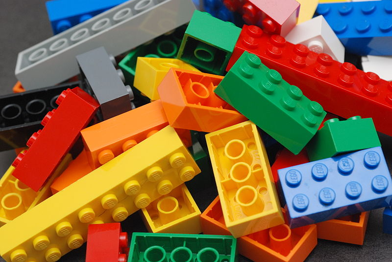

=======
# OH! : Open Hardware for FPGA and ASIC designers

## CONTENT

| Module                     | Status  | Description                              |
|----------------------------|---------|------------------------------------------|
| [accelerator](accelerator) | FPGA    | Accelerator tutorial                     |
| [common](common)           | SILICON*| Library of generally useful components   |
| [emesh](emesh)             | SILICON | Emesh interface utility circuits         |
| [elink](elink)             | SILICON | Point to point LVDS link                 |
| [emailbox](emailbox)       | FPGA    | Mailbox with interrupt output            |
| [emmu](emmu)               | FPGA    | Memory transaction translation unit      |
| [irqc](irqc)               | SILICON | Epiphany nested interrupt controller     |
| [xilibs](xilibs)           | FPGA    | Simulation modules for Xilinx primitives |

**NOTES:**
* "SILICON": Silicon validated
* "FPGA":    FPGA validated
* "SIM":     Simulation only 
* Common folder includes modules with mixed status. Some are silicon validated, others have only been simulated.

## LICENSE
The OH! repository source code is licensed under the MIT license unless otherwise specified. See [LICENSE](LICENSE) for MIT copyright terms. Design specific licenses can be found in the folder root (eg: aes/LICENSE) 

## CONTRIBUTING
Instructions for contributing can be found [HERE](CONTRIBUTING.md).

## RECOMMEND TOOLS

* [Verilator Simulator](http://www.veripool.org/wiki/verilator)
* [Emacs Verilog Mode](http://www.veripool.org/wiki/verilog-mode)
* [Icarus Simulator](http://iverilog.icarus.com)
* [GTKWave](http://gtkwave.sourceforge.net)
* [Verilog-Perl](http://www.veripool.org/wiki/verilog-perl)

## RECOMMENDED READING

* [Verilog Quick Reference](verilog/verilog_reference.md)
* [Sunburst Design Verilog Papers](http://www.sunburst-design.com/papers)
* [Sutherland Verilog Papers](http://www.sutherland-hdl.com/papers.html)

----
[picture-license](https://commons.wikimedia.org/wiki/File:Lego_Color_Bricks.jpg)

