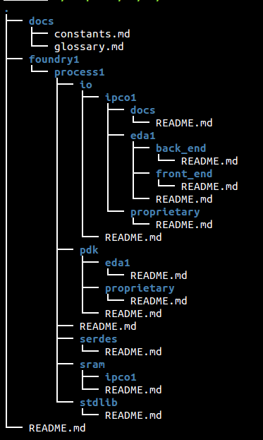

CHIP DESIGN REFERENCE FLOW
=======================================

This folder contains the recommended directory structure for implementing ASICs using OH! The directory structure is based on two decades of chip design experience (from 0.35um to 14nm) and is currently being used by Adapteva to design Epiphany based ASICs.  

The structure is designed to simplify implementation scripts and maximize portability across:
* multiple foundries
* multiple process nodes
* multiple IP vendors
* multiple EDA vendors

## RESOURCES
* [Glossary](docs/glossary.md)
* [Constants](docs/constants.md)

## DIRECTORY STRUCTURE & NAMING METHODOLOGY

* **docs**: Common documents and design guidelines
* **foundry name ("foundry1")**: tsmc, gf, tower, smic, umc, etc
* **process name ("process1")**: 28slp, 65g, etc
* **hard ip name**: pdk, stdlib, io, sram, serdes, etc
* **IP company name ("ipco1")**: arm, synopsys, cadence, tsmc, etc
* **eda name ("eda1")**: synopsys, cadence, mentor, etc

Description of contents inside each folder can be found in the local README.md file.

To visualize the directory structure, use the 'tree' utility. 

## CONTRIBUTION NEEDED
Non-disclosure agreements prevent populating the directory with exact script and process details. If you have access to an open process, then please do subnmit a PR with a populated technology tree

