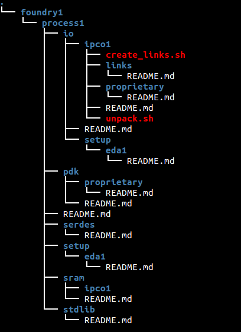

CHIP DESIGN REFERENCE FLOW
=======================================

This folder contains the recommended directory structure for implementing ASICs using OH! The directory structure is based on two decades of chip design experience (from 0.35um to 14nm) and is currently being used by Adapteva to design Epiphany based ASICs.  

The structure is designed to simplify implementation scripts and maximize portability across:
* multiple foundries
* multiple process nodes
* multiple IP vendors
* multiple EDA vendors

## RESOURCES
* [Glossary](docs/glossary.md)
* [Constants](docs/constants.md)

## DIRECTORY STRUCTURE & NAMING METHODOLOGY

| DIRECTORY NAME             | DESCRIPTION                                   |
|----------------------------|-----------------------------------------------|
| docs                       | open source documents and design guidelines   |
| synthesis                  | open source synthesis scripts                 |
| pnr                        | open source place & route scripts             |
| signoff                    | open source signoff scripts                   |
| eda                        | eda proprietary scripts                       |
| foundry ("foundry1")       | tsmc, gf, tower, smic, umc, etc               |
|   process ("process1")     | 28slp, 65g, etc                               |
|   IP types("ip1")          | pdk, stdlib, io, sram, serdes, etc            |
|   IP company name ("ipco1")| arm, synopsys, cadence, tsmc, etc             |
|   eda company name ("eda1")| synopsys, cadence, mentor, etc                |
|   proprietary              | content under NDA not for distribution        |
 


Description of contents inside each folder can be found in the local README.md file.

To visualize the directory structure, use the 'tree' utility. 

## Required Shell Variables

| SHELL VARIABLE   | DESCRIPTION                            |
|------------------|----------------------------------------|
| $PROCESS_HOME    | Path to foundry process                |
| $OH_HOME         | Path to OH repo home                   |
| $EDA_HOME        | Path to private repo or "$OH_HOME/eda" |

## Required TCL Variables ("Designer API")

| TCL VARIABLE     | DESCRIPTION                         |
|------------------|-------------------------------------|
| $OH_VENDOR       | synopsys, cadence, etc              |
| $OH_TOOL         | dc, rc, etc                         |
| $OH_DESIGN       | Name of top level module            |
| $OH_FILES        | Design files "-f commands"          |
| $OH_LIBS         | Synthesis libraries (ex: my_svtlib) |
| $OH_MACROS       | Hard macros in design (ex: my_sram) |
| $OH_FLOORPLAN    | Floorplanning file (tcl)            |
| $OH_CONSTRAINTS  | Timing constraints file             |

## Example Design

```tcl
set OH_VENDOR     "synopsys"

set OH_TOOl       "dc"

set OH_DESIGN     "ecore"

set OH_LIBS       ""

set OH_MACROS     ""

set OH_FILES      "../../../hdl/$OH_DESIGN.v             \
                   -y $env(OH_HOME)/emesh/hdl            \
                   -y $env(OH_HOME)/common/hdl           \
                   -y $env(EPIPHANY_HOME)/chip/hdl       \
                   -y $env(EPIPHANY_HOME)/ecore/hdl      \
                   -y $env(EPIPHANY_HOME)/emesh/hdl      \
                   -y $env(EPIPHANY_HOME)/edma/hdl       \
                   -y $env(EPIPHANY_HOME)/compute/hdl    \
                   -y $env(EPIPHANY_HOME)/memory/hdl     \
                   -y $env(EPIPHANY_HOME)/fpumm/hdl      \
                   +incdir+$env(EPIPHANY_HOME)/emesh/hdl \
                   +incdir+$env(EPIPHANY_HOME)/ecore/hdl \
                   +incdir+$env(EPIPHANY_HOME)/edma/hdl"

set OH_CONSTRAINTS       ${OH_DESIGN}.sdc

set OH_FLOORPLAN         ${OH_DESIGN}_floorplan.tcl

```

## Usage Example ("synthesis step")

```
>> cd 
>> dc_shell -topographical_mode
dc_shell> source $OH_HOME/synthesis/example.tcl
```

