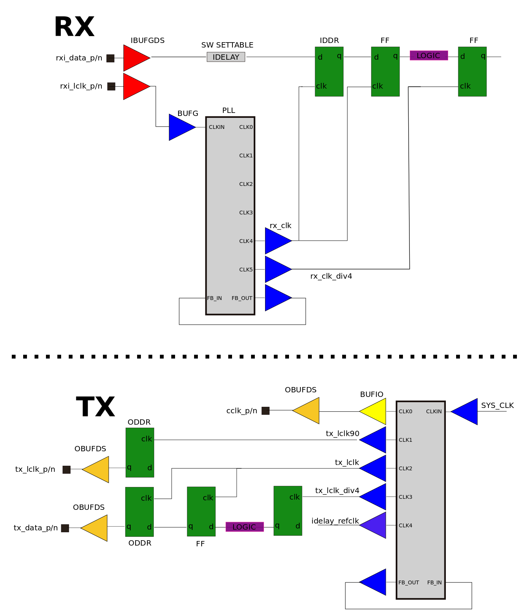

ELINK INTRODUCTION
=====================================

The "elink" is a low-latency/high-speed interface for communicating between FPGAs and ASICs (such as the Epiphany multicore ASICs). The interface can achieve up to 8 Gbit/s (duplex) in fast speed grade FPGAs using 24 LVDS signal pairs.

----------------------------------------------------------------------------

## CONTENT

1.  [MODULE SPECIFICATIONS](#module-specifications)  
  1. [IO interface](#io-interface)
  1. [Packet format](#packet-format)
  1. [Design structure](#design-structure)
  1. [Module interface](#module-interface)
  1. [Registers](#registers)
2.  [TESTBENCH](#testbench)
  2. [Simulation instructions](#simulation-instructions)
  2. [Test format](#test-format)
  2. [Random transaction generator](#random-transaction-generator)
3.  [FPGA DESIGN](#fpga-design)
  3. [Clocking and reset](#clocking-and-reset)
  3. [Resource summary](#resource-summary)
  3. [Synthesis scripts](#synthesis-scripts) 

----------------------------------------------------------------------------

MODULE SPECIFICATIONS
================================================

## IO interface

The default elink communication protocol uses source synchronous clocks, a packet frame signal, 8-bit wide dual data rate data bus, and separate read and write packet wait signals to implement a glueless point to point link. The elink has a modular structure allowing the default communication protocol to be changed simply by modifying the "etx_io" and "erx_io" blocks.    

```
               ___     ___     ___     ___     ___     ___     ___     ___ 
 LCLK     \___/   \___/   \___/   \___/   \___/   \___/   \___/   \___/
           _______________________________________________________________
 FRAME   _/                                                        \______ 
               
 DATA   XXXX|B00|B01|B02|B03|B04|B05|B06|B07|B08|B09|B10|B11|B12|B13|B14

```
           
BYTE     | DESCRIPTION 
---------|--------------
B00      | R0000A00 (R=1 for reads, A=1 burst with autoincrement)
B01      | {ctrlmode[3:0],dstaddr[31:28]}
B02      | dstaddr[27:20]
B03      | dstaddr[19:12]
B04      | dstaddr[11:4]
B05      | {dstaddr[3:0],datamode[1:0],write,access}
+B06     | data[31:24]
+B07     | data[23:16]
+B08     | data[15:8]
++B09    | data[7:0]
B10      | data[63:56] or srcaddr[31:24]
B11      | data[55:48] or srcaddr[23:16]
B12      | data[47:40] or srcaddr[15:8]
B13      | data[39:32] or srcaddr[7:0]
+++B14   | data[31:24] in 64 bit write burst mode only
B15      | data[23:16] in 64 bit write burst mode only
...      | ...

+B01-B06: srcaddr used for read request, otherwise data  
++B09: is the last byte of 32 bit write or read transaction    
+++B14: is the first data byte of bursting transaction  
 
The rising edge FRAME signal (sampled on the positive edge of LCLK) indicates the start of a new transmission. The byte captured on the first positive clock edge of the new packet is B00.  If the FRAME control signal stays high after B13, then the elink automatically enters “bursting mode”, meaning that the  last byte of the previous transaction (B13) will be followed by B06 of a new transaction.  

Read and write wait signals are used to stall transmission when a receiver is unable to accept more transactions. The receiver will raise its WAIT output signal during an active transmission indicating that it can receive ONLY one more transaction. The wait signal seen by the transmitter is of unspecified phase delay (while still of the LCLK clock period) and therefore has to be sampled with the two-cycle synchronizer.  If the transaction is in the middle of the transmission when the synchronized WAIT control goes high, the transmission process is to be completed without interruption.    


```
          ___     ___     ___     ___     ___     ___     ___     ___ 
 TXO_LCLK    \___/   \___/   \___/   \___/   \___/   \___/   \___/   \___/

                            ______________________________________________
 TXI_WAIT    ______________/--------------->| (2 cycle synchronizer)
             _______________________________
 TXO_FRAME                                  \___________________________

```

## Packet format  

Communication between the elink and the system side (i.e. the AXI side) is done using 104 bit parallel packet interfaces. Read, write, and read response transactions have independent channels into the elink. Data from a receiver read request is expected to return on the read response transmit channel.   

The "access" signals indicate a valid transaction. The wait signals indicate that the receiving block is not ready to receive the packet. An elink packet has the following bit ordering.  

 PACKET FIELD  | BITS    | DESCRIPTION 
 --------------|---------|----------
 write         | [0]     | Indicates a write transaction
 datamode[1:0] | [2:1]   | Datasize (00=8b,01=16b,10=32b,11=64b)
 ctrlmode[3:0] | [6:3]   | Various special modes for the Epiphany chip
 reserved      | [7]     | Reserved for future use
 dstraddr[31:0]| [39:8]  | Address for write, read-request, or read-responses
 data[31:0]    | [71:40] | Data for write transaction, data for read response
 srcaddr[31:0] | [103:72]| Return address for read-request, upper data for write


    
## Module interface
   
SIGNAL             | DIR| DESCRIPTION 
-------------------|----|--------------
m_*                | IO | AXI master interface
s_*                | IO | AXI slave interface
*******************|****|***********************************
txo_frame_{p/n}    | O  | TX packet framing signal
txo_lclk_{p/n}     | O  | TX clock aligned in the center of the data eye
txo_data_{p/n}[7:0]| O  | TX dual data rate (DDR) that transmits packet
txi_rd_wait_{p/n}  | I  | TX push back (input) for read transactions
txi_wd_wait{p/n}   | I  | TX push back (input) for write transactions
rxi_frame_{p/n}    | I  | RX packet framing signal.
rxi_lclk_{p/n}     | I  | RX clock aligned in the center of the data eye
rxi_data_{p/n}[7:0]| I  | RX dual data rate (DDR) that transmits packet
rxo_rd_wait_{p/n}  | O  | RX push back (output) for read transactions
rxo_wr_wait_{p/n}  | O  | RX push back (output) for write transactions
*******************|****|***********************************
reset              | I  | Reset input  
pll_clk            | I  | Clock input for CCLK/LCLK PLL  
sys_clk            | I  | System clock for FIFOs
embox_not_empty    | O  | Mailbox not empty (connect to interrupt line)   
embox_full         | O  | Mailbox is full indicator
e_chipid[11:0]     | O  | ID for Epiphany chip  (optional)  
e_resetb           | O  | Active low reset for Epiphany chip (optional)  
e_cclk_{p/n}       | O  | High speed clock for Epiphany chip (optional)  


## Design structure


```
elink
 |----emaxi (AXI master interface)
 |----esaxi (AXI slave interface)
 |----ereset (elink and chip reset generator)
 |----ecfg_clocks (elink clock and reset configuration)
 |----eclocks (PLL instantiation)
 |----ecfg_cdc (etx-->erx path for configuration register access)
 |----erx (receive path)
 |     |----erx_io (chip level I/O interface
 |     |----erx_core
 |     |     |----erx_protocol (elink protocol-->emesh packet converter)
 |     |     |----erx_remap (simple dstaddr remapping)
 |     |     |----erx_mmu (advanced dstaddr mapping)
 |     |     |----erx_cfgif (configuration interface)
 |     |     |----erx_cfg (basic rx config registers)
 |     |     |----erx_mailbox (fifo style mailbox with interrupt output)
 |     |     |----erx_dma (RX DMA)
 |     |     |----erx_arbiter (sends RX transaction to WR/RD/RR fifo)
 |     |----erx_fifo
 |           |----rxwr_fifo (write fifo)
 |           |----rxrd_fifo (read request fifo)
 |           |----rxrr_fifo (read response fifo)
 |----etx (transmit path)
       |----etx_io (chip level I/O interface)
       |----etx_core
       |     |----etx_protocol (emesh-->elink protocol converter)
       |     |----etx_remap (simple dstaddr remapping)
       |     |----etx_mmu (advanced dstaddr mapping)
       |     |----etx_cfgif (configuration interface)
       |     |----etx_cfg (basic rx config registers)
       |     |----etx_arbiter (sends rx transaction to WR/RD/RR fifo)
       |----etx_fifo
             |----txwr_fifo (write fifo)     
             |----txrd_fifo (read request fifo)
             |----txrr_fifo (read response fifo)
 --------------------------------------------------------------------
```


## Registers
 
The full 32 bit physical address of an elink register is the address seen below added to the 12 bit elink ID that maps to address bits 31:20.  As an example, if the elink ID is 0x810, then writing to the ELINK_RESET register would be done to address 0x810F0200. Readback is done through the txrd channel with the source address sub field set to 810Dxxxx;
 
REGISTER         | ACCESS | ADDRESS | DESCRIPTION 
-----------------|--------|---------|------------------
ELINK_RESET      | -W     | 0xF0200 | Soft reset
ELINK_CLK        | -W     | 0xF0204 | Clock configuration
ELINK_CHIPID     | RW     | 0xF0208 | Chip ID for Epiphany pins
ELINK_VERSION    | RW     | 0xF020C | Version number (static)
ELINK_TXCFG      | RW     | 0xF0210 | TX configuration
ELINK_TXSTATUS   | RW     | 0xF0214 | TX status
ELINK_TXGPIO     | RW     | 0xF0218 | TX data in GPIO mode
ELINK_TXMONITOR  | RW     | 0xF021C | TX transaction monitor
ELINK_TXPACKET   | R-     | 0xF0220 | TX packet sampler
ELINK_RXCFG      | RW     | 0xF0300 | RX configuration
ELINK_RXSTATUS   | R-     | 0xF0304 | RX status register
ELINK_RXGPIO     | R-     | 0xF0308 | RX data in GPIO mode
ELINK_RXOFFSET   | RW     | 0xF030C | RX mem offset in remap mode
ELINK_RXDELAY0   | RW     | 0xF0310 | RX idelays 4 bit lsb values d[7:0]
ELINK_RXDELAY1   | RW     | 0xF0314 | RX idelay taps {all msbs,frame lsbs}
ELINK_RXTESTDATA | RW     | 0xF0318 | RX sampled data
ELINK_MAILBOXLO  | RW     | 0xF0730 | Mailbox (lower 32 bit)
ELINK_MAILBOXHI  | RW     | 0xF0734 | Mailbox (upper 32 bits)
ELINK_MAILBOXSTAT| RW     | 0xF0738 | Mailbox status 
ELINK_TXMMU      | -W     | 0xE0000 | TX MMU table 
ELINK_RXMMU      | -W     | 0xE8000 | RX MMU table 

## ELINK_RESET (0xF0200)
Reset control register for the elink and Epiphany chip

FIELD    | DESCRIPTION 
-------- | --------------------------------------------------
 [0]     | 0: TX active
         | 1: TX reset asserted
 [1]     | 0: RX active
         | 1: RX reset asserted

-------------------------------

## ELINK_CLK (0xF0204) (NOT IMPLEMENTED) 
Transmit and Epiphany clock settings.
  
FIELD    | DESCRIPTION 
---------| --------------------------------------------------
 [0]     | 0: cclk clock disabled
         | 1: cclk clock enabled 
 [1]     | 0: tx_lclk clock disabled
         | 1: tx_lclk clock enabled 
 [2]     | 0: cclk driven from internal PLL
         | 1: cclk driven from clkbypass[0] input 
 [3]     | 0: lclk driven from internal PLL
         | 1: lclk driven from clkbypass[1] input
 [7:4]   | 0000: cclk=pllclk/1 (MAX)
         | 0001: cclk=pllclk/2
         | 0010: cclk=pllclk/4
         | 0011: cclk=pllclk/8
         | 0100: cclk=pllclk/16
         | 0101: cclk=pllclk/32
         | 0110: cclk=pllclk/64
         | 0111: cclk=pllclk/128 (MIN)
         | 1xxx: RESERVED
 [11:8]  | 0000: lclk=pllclk/1 (NOT IMPLEMENTED!)
         | 0001: lclk=pllclk/2
         | 0010: lclk=pllclk/4
         | 0011: lclk=pllclk/8
         | 0100: lclk=pllclk/16
         | 0101: lclk=pllclk/32
         | 0110: lclk=pllclk/64 (not supported yet)
         | 0111: lclk=pllclk/128 (not supported yet)
         | 1xxx: RESERVED        
 [15:12] | PLL frequency (TBD)

-------------------------------

## ELINK_CHIPID (0xF0208)
Column and row chip id pins to the Epiphany chip.

FIELD    | DESCRIPTION 
-------- |---------------------------------------------------
 [5:2]   | Column chip  ID for Epiphany chip
 [11:8]  | Row chip ID for Epiphany chip

-------------------------------

## ELINK_VERSION (0xF020C)
Platform and revision number.

FIELD    | DESCRIPTION 
-------- |---------------------------------------------------
 [7:0]   | Platform version
 [15:8]  | Revision number

-------------------------------

## ELINK_TXCFG (0xF0210)
TX configuration settings

FIELD    | DESCRIPTION 
-------- |---------------------------------------------------
 [0]     | Not implemented (reserved for TX enable)
 [1]     | 0:  MMU disabled
         | 1:  MMU enabled
 [3:2]   | 00: Address remapping disabled
         | 01: TX addr_out = {addr[29:16],|addr[17:16]?11:00,addr[15:0]}
         | 1x: Reserved
 [7:4]   | Epiphany routing control mode bits
         | 0000: Normal routing
         | 0001: Force NORTH routing on address match (instead of "into" core)
         | 0101: Force EAST routing on address match (instead of "into" core)
         | 1001: Force SOUTH routing on address match (instead of "into" core)
         | 1101: Force WEST routing on address match (instead of "into" core)
         | 0011: Multicast routing (LABS)
 [8]     | Reservered for cltrmode[4] 
 [9]     | Control mode select for TXRD/TXWR channels
         | 0: ctrlmode field taken from incoming transmit packet
         | 1: ctrlmode field taken E_TXCFG
 [10]    | 0: Burst mode disabled
         | 1: Burst mode enabled
 [12:11] | 00: Normal transmit mode
         | 01: GPIO direct drive mode
	 
-------------------------------

## ELINK_TXSTATUS (0xF0214)
TX status register. Sticky means once a signal goes high, it stays high until register is over written.

FIELD    | DESCRIPTION 
-------- |---------------------------------------------------
[0]      | Sticky TXWR FIFO full flag
[1]      | Sticky TXRD FIFO full flag
[2]      | Sticky TXRR FIFO full flag
[3]      | Sticky TXWR wait flag
[4]      | Sticky TXRD wait flag
[5]      | Sticky TXRR wait flag
[6]      | Sticky IO input WR_WAIT flag
[7]      | Sticky IO input RD_WAIT flag
[8]      | Sticky burst detection flag

-------------------------------

## ELINK_TXGPIO (0xF0218)
Data to drive on txo_data and txo_frame pins in gpio mode
 
FIELD    | DESCRIPTION 
-------- |---------------------------------------------------
 [7:0]   | Data for txo_data pins
 [8]     | Data for txo_frame pin

-------------------------------

## ELINK_TXMONITOR (0xF021C)
Counts outgoing TX transactions
 
FIELD    | DESCRIPTION 
-------- |---------------------------------------------------
 [31:0]  | Counter value

-------------------------------

## ELINK_TXPACKET (0xF0220)
Captures address of last TX packet
 
FIELD    | DESCRIPTION 
-------- |---------------------------------------------------
 [31:0]  | Packet address

-------------------------------

## ELINK_TXMMU (0xE0000)
A table of N entries for translating incoming 12 bit address to a new value. Entries are aligned on 8 byte boundaries
 
FIELD    | DESCRIPTION 
-------- |---------------------------------------------------
 [11:0]  | Output address bits 31:20
 [43:12] | Output address bits 63:32 (TBD)
 
## ELINK_RXCFG (0xF0300)
RX configuration register

FIELD    | DESCRIPTION 
-------- |---------------------------------------------------
 [0]     | 0: Normal Reciever mode
         | 1: Puts RX in testmode 
 [1]     | 0: MMU disabled
         | 1: MMU enabled
 [3:2]   | RX address remapping mode
         | 00: pass-through mode, remapping disabled
         | 01: "static" remap_addr =  
         | (remap_sel[11:0] & remap_pattern[11:0]) |
	     | (~remap_sel[11:0] & addr_in[31:20]); 
         | 10: "dynamic" remap_addr = 
         | addr_in[31:0]
	     | - (colid << 20)
	     | + ERX_OFFSET[31:0]
         | - (addr_in[31:26]<<clog2(colid));
 [15:4]  | Remap selection for "01" remap method 
         | "1" means remap bit is selected
 [27:16] | Remap values (for addr[31:20)
 [28]    | Enable mailbox interrupt
------------------------------

## ELINK_RXSTATUS (0xF0304)
RX status register. All bits are sticky.

FIELD    | DESCRIPTION 
-------- |---------------------------------------------------
[0]      | RXWR wait went high
[1]      | RXRD wait went high
[2]      | RXRR wait went high
[3]      | WR_WAIT output pin went high
[4]      | RD_WAIT output pin went high

## ELINK_RXGPIO (0xF0308)
RX status register. Data sampled on  rxi_data and rxi_frame pins in gpio mode

FIELD    | DESCRIPTION 
-------- |---------------------------------------------------
 [7:0]   | Data from rxi_data pins
 [8]     | Data from rxi_frame pin

## ELINK_RXOFFSET (0xF030C)
Address offset used in the dynamic address remapping mode.

FIELD    | DESCRIPTION 
-------- |---------------------------------------------------
 [31:0]  | Memory offset

-------------------------------

## ELINK_RXDELAY0 (0xF0310)
Four bit LSB fields for the RX IDELAY of data bits [7:0]

FIELD    | DESCRIPTION 
-------- |---------------------------------------------------
[3:0]    | d[0] delay value lsb's
[7:4]    | d[1] delay value lsb's
[11:8]   | d[2] delay value lsb's
[15:12]  | d[3] delay value lsb's
[19:16]  | d[4] delay value lsb's
[23:20]  | d[5] delay value lsb's
[27:24]  | d[6] delay value lsb's
[31:28]  | d[7] delay value lsb's
 
-------------------------------

## ELINK_RXDELAY1 (0xF0314)
MSB field for all RX IDELAY values and lsbs for frame signal

FIELD   | DESCRIPTION 
--------|---------------------------------------------------
[35:32] | frame signal delay value lsb's
[36]    | d[0] delay value msb
[37]    | d[1] delay value msb
[38]    | d[2] delay value msb
[39]    | d[3] delay value msb
[40]    | d[4] delay value msb
[41]    | d[5] delay value msb
[42]    | d[6] delay value msb
[43]    | d[7] delay value msb
[44]    | frame delay value msb
 
-------------------------------

## ELINK_TESTDATA (0xF0318)
Debug register for monitoring incoming transctions.

FIELD   | DESCRIPTION 
--------|---------------------------------------------------
[31:0]  | Updated with (old value + value of incoming RX transaction)

-------------------------------

## ELINK_MAILBOXLO (0xF0730)
Lower 32 bit word of current entry of RX 64-bit wide mailbox FIFO. Must be read before ELINK_MAILBOXHI is read

FIELD    | DESCRIPTION 
-------- |---------------------------------------------------
 [31:0]  | Upper data of RX FIFO

-------------------------------

## ELINK_MAILBOXHI (0xF0734)
Upper 32 bit word of current entry of RX 64-bit wide mailbox FIFO. Reading this register causes the RX FIFO read pointer to increment by one.

FIELD    | DESCRIPTION 
-------- |---------------------------------------------------
 [31:0]  | Upper data of RX FIFO

## ELINK_MAILBOXSTAT (0xF0738)
Status of mailbox

FIELD    | DESCRIPTION 
-------- |---------------------------------------------------
 [0]     | Mailbox is NOT empty
 [1]     | Mailbox is full
 [2]     | Mailbox is half full
 [31:16] | Number of messsages in mailbox

## ELINK_RXMMU (0xE8000)
A table of N entries for translating incoming 12 bit address to a new value. Entries are aligned on 8 byte boundaries.
 
FIELD    | DESCRIPTION 
-------- |---------------------------------------------------
 [11:0]  | Output address bits 31:20
 [43:12] | Output address bits 63:32 (TBD)

TESTBENCH
================================================

## Simulation instructions
You can simulate the elink using the open source ICARUS verilog simulator. Proprietary Verilog simulators should also work.(although we haven't tried them) 

```sh
$ sudo apt-get install gtkwave iverilog 
$ cd oh/elink/dv
$ ./build.sh
$ ./run.sh test/test_hello.memh
$ gtkwave waveform.vcd #to view results
```

## Test format
The elink simulator reads in a test file with the format seen below:

```
<srcaddr>_<data>_<dstaddr>_<ctrlmode><datamode><wr/rd>_<delay>
```

Example: (tests/test_hello.memh)

```sh
AAAAAAAA_11111111_80800000_05_0010 //32 bit write
AAAAAAAA_22222222_80800004_05_0010 //
AAAAAAAA_33333333_80800008_05_0010 //
AAAAAAAA_44444444_8080000c_05_0010 //
AAAAAAAA_55555555_80800010_05_0010 //
810D0000_DEADBEEF_80800000_04_0010 //32 bit read
810D0004_DEADBEEF_80800004_04_0010 //
810D0008_DEADBEEF_80800008_04_0010 //
810D000c_DEADBEEF_8080000c_04_0010 //
810D0010_DEADBEEF_80800010_04_0010 //
```

## Random transaction generator
Directed testing will only get you so far so we created a simple random transaction generator that produces sequences of different data format and burst lenghts. To generate a random testfile and simulate:.

```sh
$ cd oh/elink/dv
$ ./gen_random.sh 100
$ ./run.sh test/test_random.memh
$ diff test_0.trace test/test_random.exp
```

FPGA DESIGN
================================================

## Clocking and reset
The elink has the following clock domains:

* sys_clk : used by the axi interfaces
* rxi_lclk_div4: Used for the erx_core logic
* txo_lclk_div: Used for the etx_core logic
* rxi_lclk: Used by the erx_io for clocking in dual data rate data at pins
* txo_lclk: Used by the etx_io for transmitting dual rate data at pins
* txo_lclk90: The txo_lclk phase shifted by 90 degrees. Used by RX to sample the dual data rate data.

The elink uses a mix of asynchronous and synchronous reset out of necessity. Asynchronous reset is used where needed in the RX block because we cannot guarantee a free running clock.

The reset and clocking circuitry can be found in the "etx_clocks" and "erx_clocks" blocks.



## Resource summary
The following table shows the rough resource usage of the elink synthesized with the xc7z010clg400-1 as a target. (as of May 12, 2015)

Instance             |Module                   | FPGA Cells 
---------------------|-------------------------|------------
  elink              | elink                   |  9809
  --ecfg_cdc         | fifo_cdc                |   994
  --erx              | erx                     |  5200
  ----erx_core       | erx_core                |  2450
  ----erx_fifo       | erx_fifo                |  2711
  ----erx_io         | erx_io                  |    34
  --etx              | etx                     |  3596
  ----etx_core       | etx_core                |   890
  ----etx_fifo       | etx_fifo                |  2685
  ----etx_io         | etx_io                  |    21
  
## Synthesis scripts
The following example shows how to build a display-less (ie headless) FPGA bitstream for the Parallella board. You will need to install Vivado 2015.2 on your own.
```sh
$ cd oh/parallella/fpga/parallella_base
$ ./build.sh
$ cd ../headless
$ ./build.sh
```
