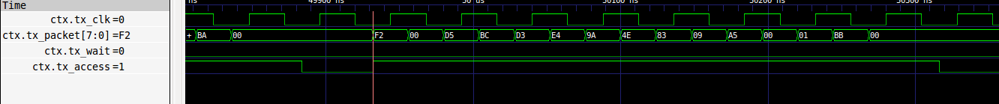

Mini-IO: A lightweight parallel interface
=============================================


## Introduction
* Mini-IO (MIO) is a generic protocol agnostic link for moving data between chips (or silicon dies). 

## Key Features

* Dual data rate data transfers
* Source synchronous
* Clock aligned by transmitter at 90 degrees
* Parametrized I/O and system side bus width
* Data transmitted MSB first

## Protocol



## Interface
| SIGNAL             | DIR| DESCRIPTION 
| -------------------|----|--------------
| access_in          | I  | Valid packet for TX
| data_in            | I  | Data for TX
| wait_out           | O  | Pushback from TX towards core side
| access_out         | I  | Valid packet from RX
| data_out           | I  | Data from RX
| wait_in            | O  | Pushback for RX from core side
| tx_access          | O  | TX packet framing signal
| tx_clk             | O  | TX clock aligned in the center of the data eye
| tx_data            | I  | TX DDR data                                    
| tx_wait            | I  | TX pushback from RX                            
| rx_access          | I  | RX packet framing signal
| rx_clk             | I  | RX center aligned clock 
| rx_data            | I  | RX DDR data
| rx_wait            | O  | RX pushback for TX
| clk                | I  | Core side clock
| nreset             | I  | Active low async reset
| io_clk             | I  | Clock for transmit side
| datasize           | I  | Size of data to transmit (<PW)
| divcfg[3:0]        | I  | Divider setting for TX clock divider

## Top level file
* c2c.v

## Parameters
* `CFG_MIOPW : System interface packet width
* `CFG_MIOW  : IO data width (number of data pins)

## Registers
* None

## Simulation

```
cd $OH_HOME/mio/dv
./build.sh
./run.sh dut_mio.bin tests/test_random.emf
```


